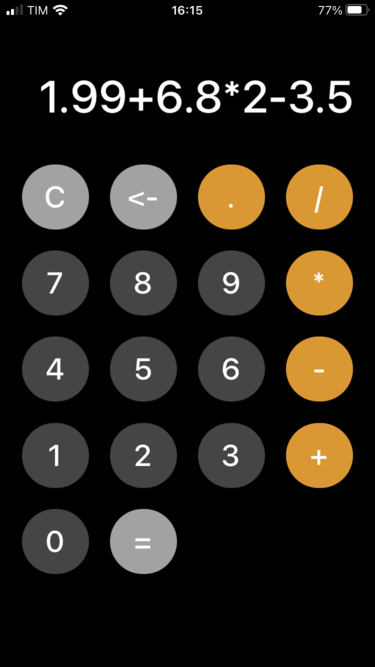

# Calculator React App

This project was developed as an assignment for CES-26 course of Instituto Tecnológico de Aeronáutica.
It is a React Native App for a calculator that uses Redux to deal with its states.
Besides the four basic arithmetic operations, this calculator also supports floating point operations and contains clear and backspace buttons.

## Project Structure
    ├── src                       # dynamic files
      ├── components              # app components
        ├── root
          ├── Root.js             # implements calculator interface
          ├── styles.js           # styles for calculator interface
      ├── redux                   # redux files to deal with calculator states
        ├── actions.js
        ├── reducers.js
        ├── store.js
        ├── types.js
     ├── App.js                   # integrates react and redux

## Redux actions implemented

- `SET_EXPRESSION`: adds entries to the arithmetic expression.
- `EVALUATE_EXPRESSION`: calculates the result of the arithmetic expression.
- `DELETE_LAST_ENTRY`: deletes the last entry of the arithmetic expression.
- `CLEAR_EXPRESSION`: clears the arithmetic expression.

The implementation of these actions deals with some possible errors of usage by the user.

## Running the project

To facilitate testing, this app was developed using the Expo framework. Thus, to run it, just use the following command line:

### `expo start`

After that, you can download **Expo client app** in your phone and scan the QR code that appears in the terminal in order to run the app directly in your device.

Otherwise, you can use the following command line:
### `w`

Then, open [http://localhost:19006/](http://localhost:19006/) to view the app in the browser*.

After that, the page will reload if you make edits.\
You will also see any lint errors in the console.

*I recommend using a smartphone view in the browser.
